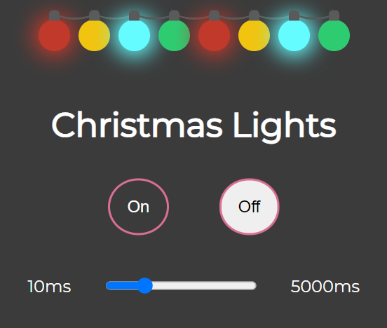

<h1 align="center">
  Christmas Lights
</h1>

## Tecnologias

Esse projeto foi desenvolvido com as seguintes tecnologias:

- HTML
- CSS
- JavaScript

## Projeto

O projeto apresenta luzes de natal com o objetivo de treinar e testar animações via CSS e JavaScript. Nele é possível ligar e desligar as luzes e ainda controlar a velocidade com que irão piscar.

## Layout

Esse é o layout do projeto

## Acesso

O projeto pode ser acessado e testado [aqui](https://gabrielpdb.github.io/christmas-lights/)

Made by [GabrielPDB](https://github.com/GabrielPDB)
